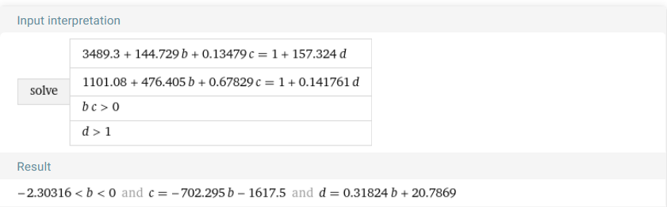

# RAMP starting kit on GAN Anime


> Authors: MAI Huu Tan, CARON Marceau, SALOMON Yohann, LIU Annie, BERTHOLOM François & BIGOT Alexandre


#### Set up

Open a terminal and

1. install the `ramp-workflow` library (if not already done)
  ```
  $ pip install ramp-workflow
  ```
  
2. Follow the ramp-kits instructions from the [wiki](https://github.com/paris-saclay-cds/ramp-workflow/wiki/Getting-started-with-a-ramp-kit)

#### Local notebook

Get started on this RAMP with the [dedicated notebook]().

To test the starting-kit, run


```
ramp-test --quick-test
```


#### Help
Go to the `ramp-workflow` [wiki](https://github.com/paris-saclay-cds/ramp-workflow/wiki) for more help on the [RAMP](https://ramp.studio) ecosystem.


---

### Mixed Score :

```python
mixed_score = (a * IS_mean + b * FID + c * KID_mean)/(1 + d * L1_norm_interpolation) 
```

We just resolved a linear equation such that :
- a cheater generator has a mixed score of 1
- a random generator (gaussian noise) has a mixed score of 1
- `b` and `c` are negative



We then choose `b=-2`
